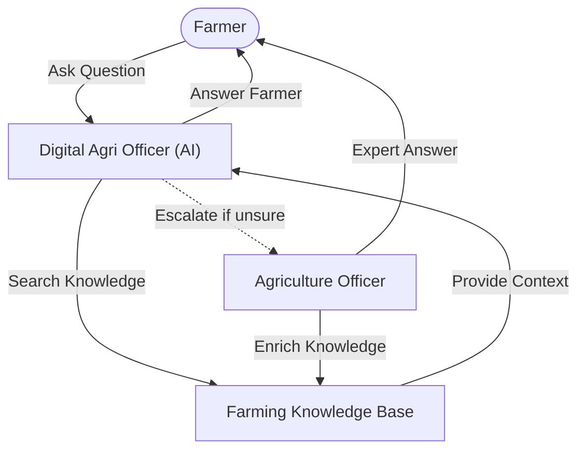

# Krishi Sahayak (Farmer Assistant) - Frontend Client

This repository contains the frontend client application for **Krishi Sahayak v2**, a modern React-based agricultural assistant dashboard. Built with **React 19**, **Vite**, and **Tailwind CSS**, it offers farmers a real-time, animated streaming chat interface for getting AI support and escalating queries to agricultural experts.

> ⚙️ **Looking for the backend server?** Refer to the [Krishi Sahayak Backend Server](https://github.com/sonu-shivcharan/krishi-sahayak-backend-v2) repository.

---

## Table of Contents
1. [Core Features](#core-features)
2. [Tech Stack](#tech-stack)
3. [System Workflow](#system-workflow)
4. [Prerequisites](#prerequisites)
5. [Setup & Installation](#setup--installation)
6. [Environment Variables](#environment-variables)
7. [Available Scripts](#available-scripts)
8. [Architecture Highlights](#architecture-highlights)

---

## Core Features

*   **Interactive AI Chat Interface**: Streaming replies backed by the Vercel AI SDK, complete with syntax highlighting and smooth UI transition animations via Framer Motion.
*   **Expert Escalation Support**: One-click forwarding of complex/dissatisfactory conversations to human agricultural officers.
*   **Officer Dashboard Workspace**: Specialized view for verified Agricultural Officers to see pending farmer questions, read chat context, and post responses.
*   **Secure Authentication & Session Guards**: Integrated with Clerk for robust email, phone, or social sign-in.
*   **Optimized Client Caching**: Uses `@tanstack/react-query` to ensure efficient client-state synchronization and cache-invalidation.

---

## Tech Stack

*   **Core UI Library**: React 19, Vite
*   **Routing**: `@tanstack/react-router` (fully type-safe route generation)
*   **State Management & Fetching**: `@tanstack/react-query`, Axios
*   **Styling & Motion**: Tailwind CSS (v4), Framer Motion, Radix UI primitives
*   **Auth Provider**: Clerk React (`@clerk/clerk-react`)
*   **Streaming UI**: Vercel AI SDK (`ai`), Lucide React icons

---

## System Workflow

The client application facilitates an intelligent interaction loop between the **Farmer**, the **AI Assistant**, the **Knowledge System**, and the **Human Help System**:



### Workflow Steps:
1. **Ask Farming Question**: The **Farmer** inputs a query on the dashboard.
2. **Look for Related Information**: The **Digital Agri Officer (AI)** searches the **Farming Knowledge Base** for related documents.
3. **Useful Details**: Relevant context matches are returned.
4. **Resolve or Escalate**:
   * **Tier 1 (Auto-resolve)**: The AI Assistant directly streams the answer back to the Farmer if context is sufficient.
   * **Tier 2 (Escalate)**: If the AI is unsure, the query is escalated to nearby **Agriculture Officers**, sending a push notification to them immediately using **Firebase Cloud Messaging (FCM)**.
5. **Expert Answer**: The **Agriculture Officer** responds, which triggers a push notification via **FCM** notifying the **Farmer** that their query has been resolved with an expert response.
6. **Enrich Knowledge Base**: The officer's answer is added to the **Farming Knowledge Base** so the AI can handle similar questions automatically next time.

---

## Prerequisites

Before setting up, make sure you have:
*   [Node.js](https://nodejs.org/) (v18+) or [Bun](https://bun.sh/)
*   The URL of a running **Krishi Sahayak Backend Server** (e.g., `http://localhost:3000`)

---

## Setup & Installation

1. Navigate to the client directory:
   ```bash
   cd frontend
   ```

2. Install client dependencies:
   ```bash
   bun install
   # or
   npm install
   ```

3. Create the `.env` configuration file:
   ```bash
   cp env.example .env
   ```

4. Configure the variables in `.env` (detailed below).

---

## Environment Variables

Open `.env` and fill out the following properties:

```env
# Clerk Authentication Configuration
VITE_CLERK_PUBLISHABLE_KEY="pk_test_..."

# Backend Base API Endpoint
VITE_API_URL="http://localhost:3000"

# Firebase Cloud Messaging VAPID public key
VITE_FIREBASE_VAPID="your-firebase-vapid-public-key"
```

---

## Available Scripts

*   **Start Local Dev Server** (includes Hot Module Replacement):
    ```bash
    bun run dev
    # or
    npm run dev
    ```
*   **Type-check and Build Production Bundle**:
    ```bash
    bun run build
    # or
    npm run build
    ```
*   **Preview Production Build locally**:
    ```bash
    bun run preview
    # or
    npm run preview
    ```
*   **Lint Source Code**:
    ```bash
    bun run lint
    # or
    npm run lint
    ```

---

## Architecture Highlights

*   **Type-safe Router**: Configured using `@tanstack/react-router` located under the `/src/routes/` directory. Route trees are automatically generated and validated during development compilation.
*   **RAG Engine Integration**: Consumes streaming chunks from the backend API using a custom hook for fine-grained message flow control, utilizing UI helper utilities from the Vercel AI SDK.
*   **Role-based Layout Separation**: Distinct user flows are guarded by authentication checks, routing normal farmers to chat, and agricultural officers directly to the query ticket list.
